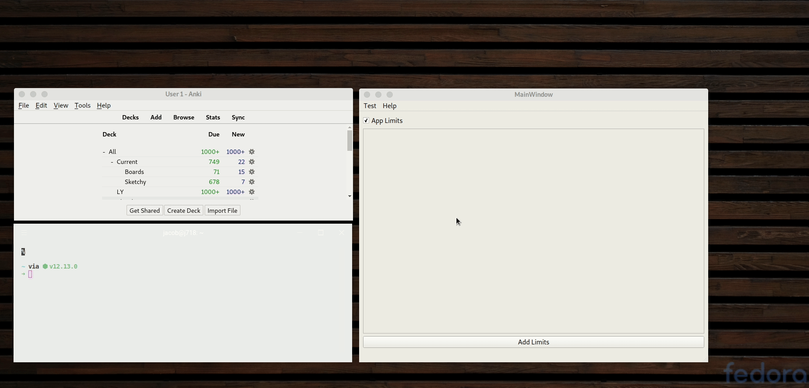

================
Screentime
================

.. image:: https://img.shields.io/badge/License-MIT-yellow
        :target: https://opensource.org/licenses/MIT

A project to limit screentime relying on activity watcher

Demo
-------------

Installation
---------------
Install Prerequisites:

- activitywatcher

Clone, Build, and Install::

    git clone git@github.com:j718/screentime.git
    make build
    sudo make install

Uninstallation::

    sudo make uninstall

Features
--------

- Create time limits for desktop applications

Roadmap
-----------
- add a github pages

Credits
-------
